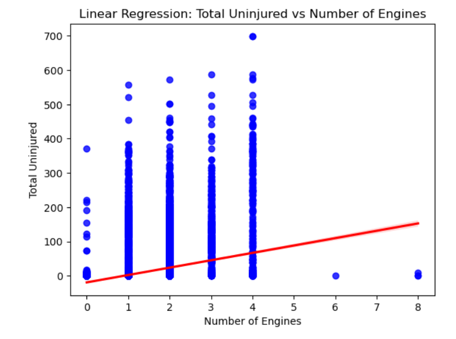

<h1>COMMERCIAL AIRCRAFTS ACCIDENT PREDICTION PROJECT</h1>

<h2>PROJECT GOAL   My project aims to predict the commercial aircrafts with low risk of accidents in the USA. </h2>
<h3>BUSINESS UNDERSTANDING</h3> Every day, approximately over 100,000 commercial aircrafts are carrying millions of passengers across the globe. Accidents, although very rare, but when they happen they are very devastating.
It is therefore prudent that data scientists across the globe could come up with a prediction model(s) that predict the accidents before they happen.
However, for this project the scope is to determine the commercial aircrafts with low risk of accidents.

 </>
<h4>DATA UNDERSTANDING This data comes from National Transportation Safety Board of USA for the period between 1962 and 2023. </h4>

<h3>DATA VISUALIZATION</h3>

<h2>CONCLUSION •	Buy the Boeing make of the aircraft because it is the safest as per the data analyzed. 
•	The model of the Aircraft seems not to play any role in the safety of the aircrafts . So buy any model that suits you<b>.
•	Buy an aircraft with a double size engine, they are more safe than aircrafts with a single size engine.
 </h2>
